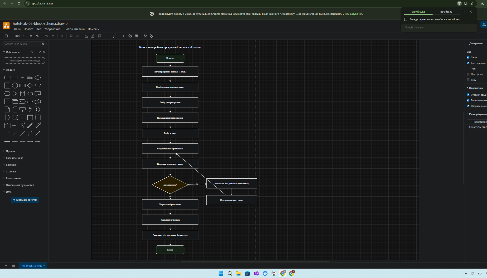
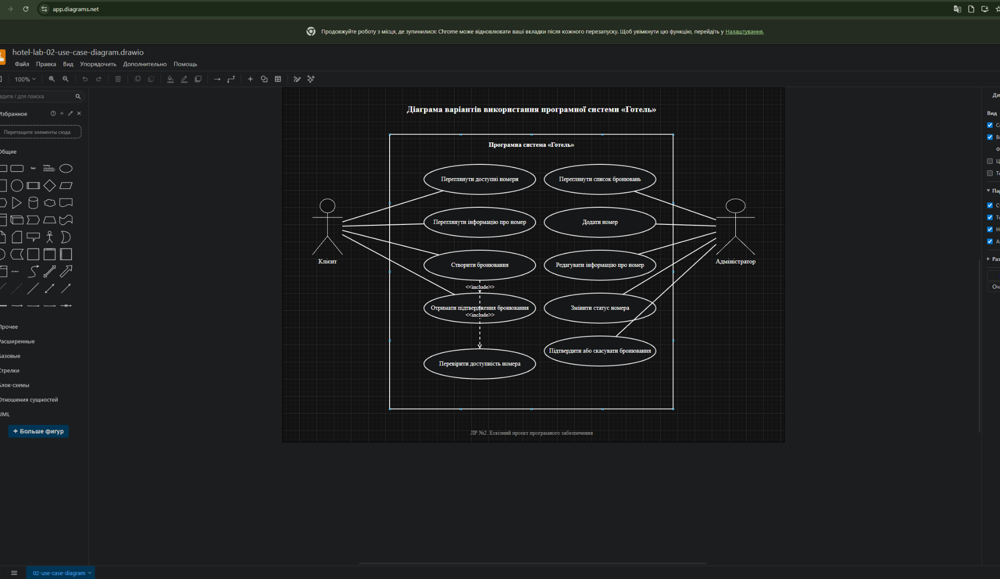
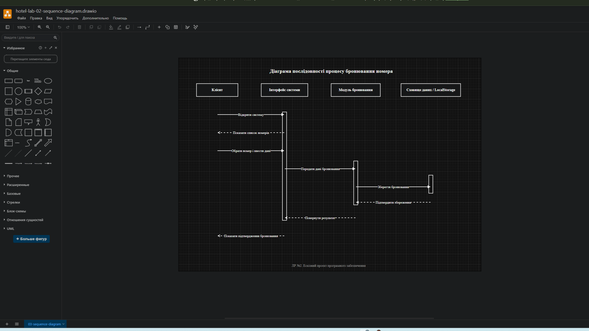
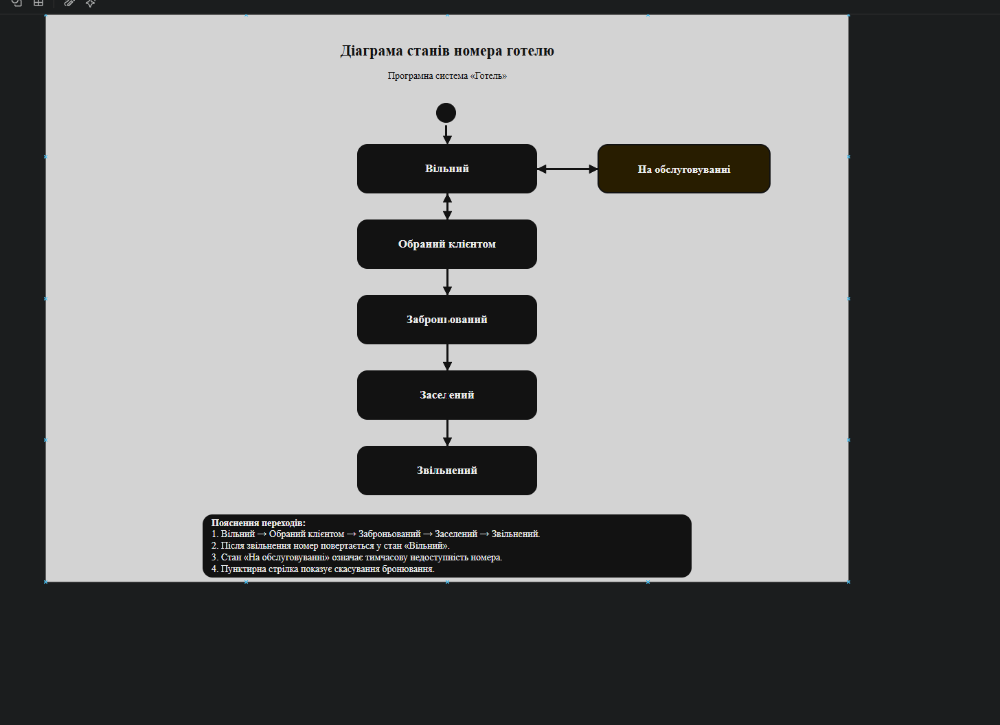

# Лабораторна робота №2  
## Ескізний проект програмної системи «Готель»

## Тема роботи

Ескізний проект.

## Мета роботи

Набути навичок з розробки ескізного проекту програмного забезпечення.

## Програмна система

**Програмна система «Готель»**

Програмна система «Готель» призначена для автоматизації основних процесів роботи готелю: перегляду доступних номерів, створення бронювань, збереження заявок клієнтів, зміни статусу номерів та адміністрування інформації про готель.

Основними користувачами системи є:

- клієнт;
- адміністратор.

Клієнт взаємодіє із системою для перегляду доступних номерів, вибору номера та створення бронювання. Адміністратор керує інформацією про номери, переглядає бронювання, змінює статуси номерів та обробляє заявки клієнтів.

---

## 2. Ескізний проект

Ескізний проект програмної системи «Готель» призначений для попереднього опису структури, логіки роботи та основних сценаріїв використання майбутнього програмного забезпечення.

У межах ескізного проекту було розроблено:

- блок-схему програми;
- діаграму варіантів використання;
- діаграму послідовності;
- діаграму станів.

---

## 2.1 Блок схема програми

Блок-схема програми відображає загальний алгоритм роботи програмної системи «Готель». Після запуску системи користувач переходить до головного меню, переглядає доступні номери, обирає номер, вводить дані бронювання та проходить перевірку коректності введених даних.

Якщо дані введено правильно, система зберігає бронювання, змінює статус номера та виводить підтвердження. Якщо дані некоректні, система повідомляє користувача про помилку та пропонує повторно ввести інформацію.



**Вихідний файл діаграми:**  
[01-block-schema.drawio](diagrams/01-block-schema.drawio)

---

## 2.2 Діаграма варіантів використання

Діаграма варіантів використання демонструє основні можливості програмної системи «Готель» та взаємодію користувачів із системою.

Клієнт має можливість:

- переглядати доступні номери;
- переглядати інформацію про номер;
- створювати бронювання;
- отримувати підтвердження бронювання.

Адміністратор має можливість:

- переглядати список бронювань;
- додавати номери;
- редагувати інформацію про номери;
- змінювати статус номера;
- підтверджувати або скасовувати бронювання.



**Вихідний файл діаграми:**  
[02-use-case-diagram.drawio](diagrams/02-use-case-diagram.drawio)

---

## 2.3 Діаграма послідовності

Діаграма послідовності описує процес бронювання номера клієнтом. Клієнт відкриває програмну систему, після чого інтерфейс відображає список доступних номерів. Далі користувач обирає номер і вводить дані бронювання.

Інтерфейс передає введені дані до модуля бронювання, який зберігає інформацію у сховищі даних. Після успішного збереження система повертає результат і показує клієнту підтвердження бронювання.



**Вихідний файл діаграми:**  
[03-sequence-diagram.drawio](diagrams/03-sequence-diagram.drawio)

---

## 2.4 Діаграма станів

Діаграма станів описує можливі стани номера готелю в програмній системі. Основним об’єктом моделювання є номер готелю.

Номер може перебувати у таких станах:

- вільний;
- обраний клієнтом;
- заброньований;
- заселений;
- звільнений;
- на обслуговуванні.

Основний життєвий цикл номера має такий вигляд: спочатку номер є вільним, потім його обирає клієнт, після підтвердження даних номер переходить у стан заброньованого. Після заселення клієнта номер отримує стан «Заселений», а після виїзду клієнта — «Звільнений». Після завершення прибирання або перевірки номер знову може стати вільним.

Окремо передбачено стан «На обслуговуванні», який означає, що номер тимчасово недоступний для бронювання.



**Вихідний файл діаграми:**  
[04-state-diagram.drawio](diagrams/04-state-diagram.drawio)

---

## Структура репозиторію

```text
hotel-lab-02-sketch-project/
│
├── README.md
│
├── diagrams/
│   ├── 01-block-schema.drawio
│   ├── 02-use-case-diagram.drawio
│   ├── 03-sequence-diagram.drawio
│   └── 04-state-diagram.drawio
│
└── screenshots/
    ├── 01-block-schema.png
    ├── 02-use-case-diagram.png
    ├── 03-sequence-diagram.png
    └── 04-state-diagram.png
```

---

## Використані інструменти

Для створення діаграм було використано онлайн-сервіс **diagrams.net**.  
У репозиторії збережено як зображення діаграм у форматі `.png`, так і вихідні файли у форматі `.drawio`, які можна відкрити та редагувати.

---

## Висновок

Під час виконання лабораторної роботи було розроблено ескізний проект програмної системи «Готель». Було визначено основні функції системи, користувачів, сценарії взаємодії та стани основного об’єкта системи — номера готелю.

Також було підготовлено блок-схему програми, діаграму варіантів використання, діаграму послідовності та діаграму станів. Результати роботи розміщено у GitHub-репозиторії разом із вихідними файлами діаграм.
